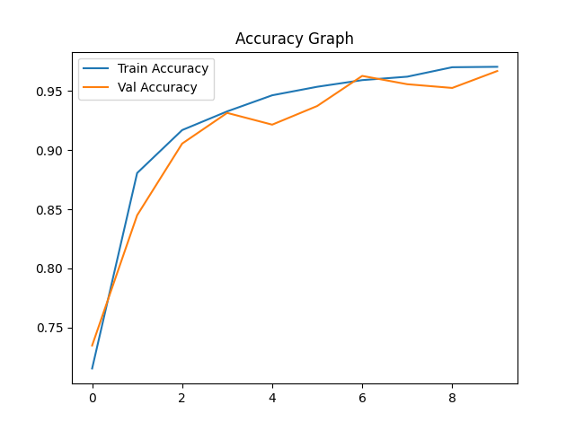
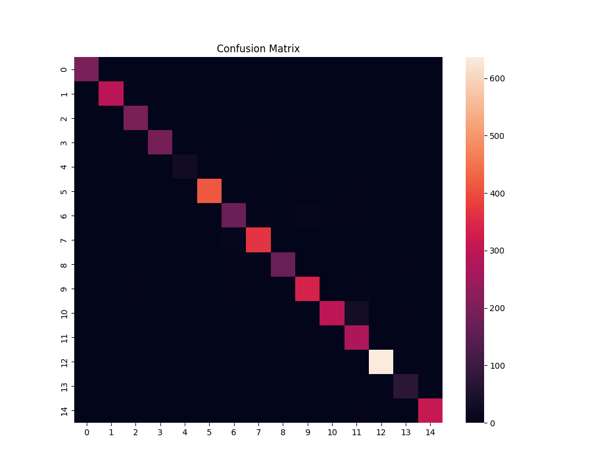
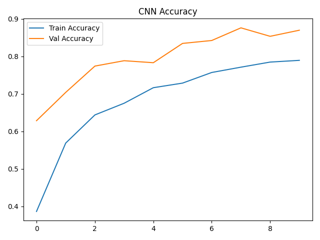
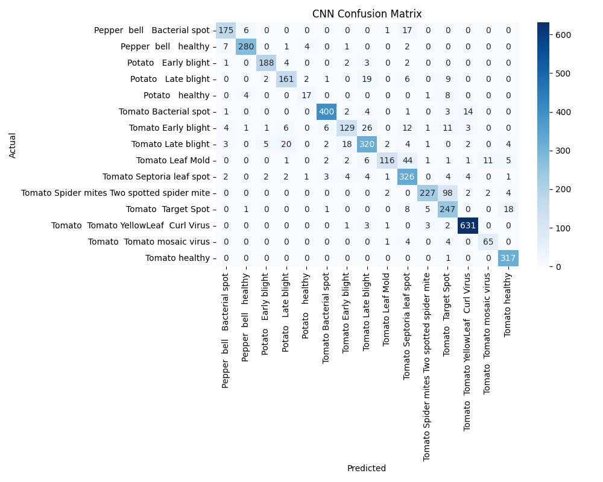

# 🌿 Crop Disease Detection — CNN vs MobileNetV2

A comparative deep learning study for plant disease classification using a **Custom CNN** and **MobileNetV2** (transfer learning), served through a premium Flask web interface.

---

## 🎯 Project Overview

This project trains and compares two neural network architectures on the [PlantVillage dataset](https://www.kaggle.com/datasets/emmarex/plantdisease) to classify **15 plant disease categories** across 3 crop types (Tomato, Potato, Pepper).

| Model | Validation Accuracy |
|---|---|
| Custom CNN | ~87% |
| MobileNetV2 (Transfer Learning) | **~97%** |

---

## 🌱 Detectable Diseases (15 Classes)

| Crop | Conditions |
|---|---|
| 🍅 Tomato | Bacterial Spot, Early Blight, Late Blight, Leaf Mold, Septoria Leaf Spot, Spider Mites, Target Spot, YellowLeaf Curl Virus, Mosaic Virus, Healthy |
| 🥔 Potato | Early Blight, Late Blight, Healthy |
| 🫑 Pepper | Bacterial Spot, Healthy |

---

## 🗂️ Project Structure

```
crop-disease-detection/
│
├── app.py                  # Flask web application
├── train.py                # MobileNetV2 training script
├── train_cnn.py            # Custom CNN training script
│
├── templates/
│   └── index.html          # Premium dark-mode web UI
│
├── static/
│   └── uploads/            # Temporary image uploads (gitignored)
│
├── models/                 # Saved .keras models (gitignored)
├── outputs/                # Training plots & reports (gitignored)
│
├── labels.json             # MobileNetV2 class index map
├── cnn_labels.json         # CNN class index map
└── requirements.txt        # Python dependencies
```

---

## 🚀 Getting Started

### 1. Clone the Repository
```bash
git clone https://github.com/Brijith58/crop-disease-detection-cnn-mobilenet.git
cd crop-disease-detection-cnn-mobilenet
```

### 2. Install Dependencies
```bash
pip install -r requirements.txt
```

### 3. Prepare the Dataset
Download the [PlantVillage dataset](https://www.kaggle.com/datasets/emmarex/plantdisease) and place it as:
```
dataset/
├── train/
│   ├── Pepper__bell___Bacterial_spot/
│   ├── Tomato_healthy/
│   └── ...
└── val/
    └── ...
```

### 4. Train the Models
```bash
# Train MobileNetV2 (recommended, ~97% accuracy)
python train.py

# Train Custom CNN (~87% accuracy)
python train_cnn.py
```
> Training outputs (plots, confusion matrices, classification reports) are saved to `outputs/`

### 5. Run the Web App
```bash
python app.py
```
Open **http://127.0.0.1:5000** in your browser.

---

## 🖥️ Web Interface

- **Drag & drop** or click to upload a leaf image
- Instant AI diagnosis with **disease label** and **confidence score**
- Animated confidence bar with health status indicator
- Supports PNG, JPG, JPEG (max 10MB)

---

## 🏗️ Model Architecture

### MobileNetV2 (Transfer Learning)
- Base: `MobileNetV2` pretrained on ImageNet
- Fine-tuned last 30 layers
- Input: 224×224×3
- Output: 15-class Softmax
- Early stopping (patience=3)

### Custom CNN
- 3× Conv2D + MaxPooling blocks
- BatchNormalization + Dropout
- Dense(512) → Dense(15, Softmax)
- Input: 224×224×3

---

## 📊 Training Results

### MobileNetV2



### Custom CNN



---

## 📦 Requirements

```
tensorflow
numpy
matplotlib
scikit-learn
seaborn
flask
pillow
```

---

## 📄 License

MIT License — feel free to use, modify, and build on this project.

---

## 🙌 Acknowledgements

- [PlantVillage Dataset](https://www.kaggle.com/datasets/emmarex/plantdisease)
- [TensorFlow / Keras](https://www.tensorflow.org/)
- [MobileNetV2 Paper](https://arxiv.org/abs/1801.04381)
